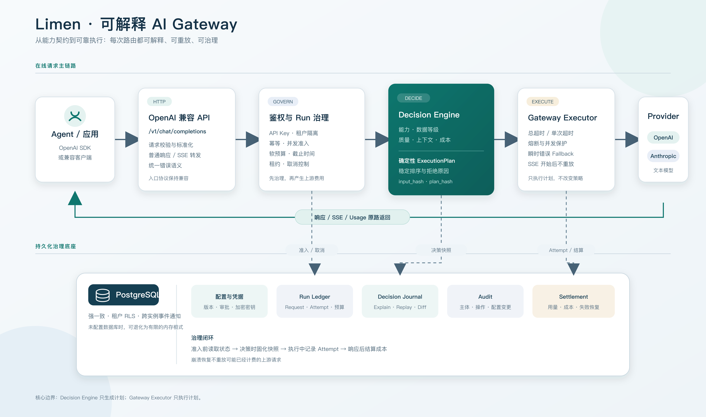

# Limen

Limen（拉丁语：门槛、入口）是一个面向 Agent 的可解释 AI Gateway。它以 OpenAI 兼容接口接收请求，根据能力、数据等级、质量和成本策略生成可重放的执行计划，再转发到 OpenAI 或 Anthropic。

当前版本：`v1.0.0-rc1`。支持文本 Chat Completions、普通响应和 SSE；暂不支持 Tools、Vision、Responses API 和多地域部署。

## 为什么是 Limen

- **能力契约路由**：客户端可以请求 `model=auto`，由网关按能力、上下文、数据等级、质量和成本选择目标，而不是只匹配模型名前缀。
- **可解释、可重放**：每次决策生成稳定的 `input_hash`、`plan_hash` 和安全快照，可以 Explain、Replay，也能比较配置变更的影响。
- **Agent Run 治理**：Run 提供软预算、截止时间、并发准入、幂等、租约、取消和结算状态，适合管理一次 Agent 任务中的多次模型调用。
- **可靠但克制的 Fallback**：只对瞬时错误切换目标；客户端取消、确定性错误和已经开始的 SSE 不重放，避免重复调用和重复计费。

## 核心能力

- OpenAI 兼容的 `POST /v1/chat/completions` 和 `GET /v1/models`。
- OpenAI、Anthropic 文本协议转换及实时 SSE 转发。
- 逻辑模型注册表、版本化配置和原子发布。
- Run 软预算、用量采集、定点成本计算和异常结算恢复。
- PostgreSQL 持久化、租户 RLS、幂等控制和跨实例取消通知。
- API Key 生命周期与加密 Provider 凭据管理。
- 熔断、总时间预算、安全出站策略和有界响应读取。
- 不记录 Prompt、Response 或密钥的日志、指标和可选 OpenTelemetry Trace。

## 架构



Decision Engine 只负责把标准化请求转换成确定性的 `ExecutionPlan`；Gateway Executor 只按计划调用 Provider，不在执行阶段改变路由策略。Run Store、Decision Journal 和 Settlement 独立保存治理状态，使崩溃恢复不需要重放可能已经计费的上游请求。

项目使用 Go 标准库实现 HTTP 数据面；PostgreSQL 和 OpenTelemetry 依赖被限制在明确边界内，不依赖 Web 框架或 ORM。

## 快速开始

要求 Go 1.24+。仓库提供可直接修改的模型目录示例：[configs/models.example.json](configs/models.example.json)。

```bash
make build
export LIMEN_API_KEY=local-limen-key
export LIMEN_MODELS_FILE="$PWD/configs/models.example.json"
export OPENAI_API_KEY=your-openai-key
export ANTHROPIC_API_KEY=your-anthropic-key
./bin/limen
```

调用逻辑模型：

```bash
curl http://localhost:8080/v1/chat/completions \
  -H 'Authorization: Bearer local-limen-key' \
  -H 'Content-Type: application/json' \
  -d '{"model":"smart-model","messages":[{"role":"user","content":"Hello"}]}'
```

Docker 启动方式：

```bash
docker build -t limen:dev .
docker run --rm -p 8080:8080 \
  -e LIMEN_API_KEY=local-limen-key \
  -e OPENAI_API_KEY=your-openai-key \
  -e ANTHROPIC_API_KEY=your-anthropic-key \
  -e LIMEN_MODELS_FILE=/etc/limen/models.json \
  -v "$PWD/configs/models.example.json:/etc/limen/models.json:ro" limen:dev
```

## 配置

| 环境变量 | 作用 |
| --- | --- |
| `LIMEN_API_KEY` / `LIMEN_API_KEY_FILE` | Limen 客户端鉴权密钥 |
| `LIMEN_MODELS_FILE` | 启动时模型目录文件 |
| `OPENAI_API_KEY` / `OPENAI_API_KEY_FILE` | OpenAI 或兼容接口密钥 |
| `ANTHROPIC_API_KEY` / `ANTHROPIC_API_KEY_FILE` | Anthropic 或兼容接口密钥 |
| `OPENAI_BASE_URL` / `ANTHROPIC_BASE_URL` | 自定义 Provider 地址 |
| `LIMEN_DATABASE_URL` | PostgreSQL DSN；设置后启用持久化治理能力 |
| `LIMEN_TENANT_ID` | 当前进程绑定的租户，默认 `local` |
| `LIMEN_REQUEST_TIMEOUT` | 单次请求总时间预算，默认 `60s` |

完整的部署、Key Store、凭据、Run、结算、指标和故障排查说明见 [运维文档](docs/operations.md)。OpenAI 请求字段、错误和 SSE 兼容边界见 [兼容性说明](docs/openai-compatibility.md)。

## 开发与验证

```bash
make check          # 格式、注释、静态分析、Replay 一致性和竞态测试
make compatibility  # OpenAI 请求、错误和 SSE 兼容契约
make reliability    # Fallback、超时、取消和流式不重放
make integration    # PostgreSQL 并发、RLS、租约和恢复测试
make smoke          # 真实二进制冒烟测试
make demo           # 离线演示能力路由、Fallback 和结算
make release-check  # 完整离线发布门禁
```

测试不依赖真实 Provider；手动真实联调必须显式设置 `LIMEN_LIVE_TEST=1` 后运行 `make release-live`。

## 文档与版本

- [OpenAI 兼容性](docs/openai-compatibility.md)
- [部署与运维](docs/operations.md)
- [v1.0.0-rc1 发布说明](docs/releases/v1.0.0-rc1.md)
- [变更记录](CHANGELOG.md)
- `limen version`：查看构建版本、提交和构建时间
