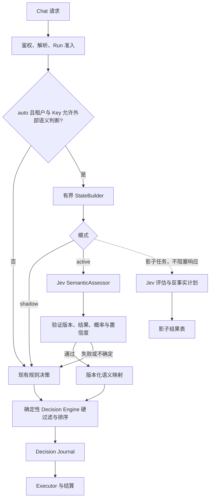

# Limen 3.0：Jev 辅助语义路由设计

状态：设计稿（2026-09-30）。本文定义目标架构与验收标准，不表示相关功能已经实现。

## 1. 决策摘要

Limen 继续以现有确定性 Decision Engine 负责权限、数据等级、能力、上下文、预算、健康状态和最终执行计划。引入一个可替换的 `SemanticAssessor`，首个实现使用 TypeSafe AI 的 Jev，为 `model=auto` 请求提供**任务类型**和**任务复杂度**两个受控信号。只有经过租户授权、评估通过且信号足够可靠时，配置版本中的映射规则才把信号转换为质量下限或候选池偏好。任何语义信号都不能扩大客户端许可的数据等级、降低客户端显式能力要求或越过硬过滤。

上线顺序是 `off → shadow → active`。`shadow` 异步评估并记录比较结果，不影响实际路由和响应时延；`active` 在有限时延内获取 Jev 判断，失败或不确定时回到现有规则计划。Jev 的运营成本由网关承担，单独计量，暂不计入 Run 的客户端软预算；评估总经济性时必须计入它。

本方案是 Limen 3.0 的路由子系统设计。Tools、Vision、Responses API、Agent 工具执行及其账务是独立工作流，不由此次接入隐式实现。

## 2. 项目现状与接口落点

当前 `POST /v1/chat/completions` 在 `internal/httpapi/handler.go` 中完成鉴权、严格解析、Run 合约注入、准入和租约，再进入 `forward`。`internal/gateway/planner.go` 构造 `decision.Input`，`internal/decision/engine.go` 只按快照生成 `ExecutionPlan`；`internal/gateway/executor.go` 依计划调用 Provider。`internal/journal` 保存不含 Prompt/Response 的输入和计划，Replay 用保存的输入重算，不重新调用 Provider。现有算法版本为 `decision.v1/v2`，输入格式为 `decision-input.v1`。

具体约束：

- `model=auto` 需要配置模式下的模型目录；显式模型和兼容模式继续按原路径运行。
- `limen` 字段已有客户端显式能力、质量、上下文、数据等级和策略。Run 还能固定策略及配置版本。Jev 不能覆盖这些治理输入。
- 文本消息是当前唯一支持的内容类型；Tools、Vision 等尚未进入兼容矩阵。
- 日志、Trace 和 Decision Journal 不保存请求正文。语义判断需要看到正文，因此要单独定义出站授权及最小化输入。
- 当前价格和质量是模型目录的配置值，不是按任务实测的质量矩阵。语义分类不能直接推导“哪个 Provider 最好”。

## 3. 外部调研（2026-09-30 核对）

| 实现 / 研究 | 已证实的机制 | 对 Limen 的启示 | 当前取舍 |
| --- | --- | --- | --- |
| [TypeSafe Jev 官方文档](https://docs.typesafe.ai/introduction/quickstart) | `POST /v1/systemone` 接收 `state` 与类型化问题，Choice、Score、Noul 返回受限值及概率；官方当前模型页列出 `jev-1.13.0` | 适合低延迟的封闭语义判断；适配器无需替换 Chat Provider | 采用 Choice 判断任务类型、Score 判断复杂度；版本固定，不使用会漂移的 `jev-latest` 别名 |
| [TypeSafe 已知限制](https://docs.typesafe.ai/model-jaggedness/jev-1.13) 与[置信度说明](https://docs.typesafe.ai/confidence) | 官方称它不适合精确算术、日期比较、长而无关的状态、复杂间接推理；Choice/Score 置信度源于概率分布 | 成本、权限、上下文长度继续由代码处理；阈值需要按本项目样本校准 | 不把单个 `confidence` 当作真实正确率；不让 Jev 决定预算或安全许可 |
| [RouteLLM 论文](https://arxiv.org/abs/2406.18665)及[源码](https://github.com/lm-sys/RouteLLM/blob/main/routellm/routers/routers.py) | 用偏好数据学习强/弱模型间路由，接口返回强模型胜率，再由阈值选模型 | 对最终“任务到模型”选择有参考价值 | 暂不引入训练器：项目缺少同任务、多模型的可比质量标签，且候选集不止两档 |
| [vLLM Semantic Router 分类实现](https://github.com/vllm-project/semantic-router/blob/main/src/semantic-router/pkg/classification/classifier.go)及[模型选择说明](https://github.com/vllm-project/semantic-router/blob/main/src/semantic-router/pkg/modelselection/README.md) | 分类信号与后续模型选择分层；学习式选择需要代表性查询与多个候选模型的实测结果 | 对 Limen 当前模块边界最贴近：先产生信号，再在允许的候选中选模型 | 借鉴接口分层与基线评估，不搬入其复杂依赖和训练运行时 |
| [LLMRouter 2026 论文](https://arxiv.org/abs/2608.06867) | 将路由分为上下文编码、模型编码、评分、决策规则、学习信号，并联合评估质量和成本 | 明确质量反馈与模型画像是 3.0 后续学习路由的前提 | 当前优先建设可比较的评估数据；论文报告的相对收益不能当作 Limen 的预期收益 |
| [JevOut 2026 预印本](https://arxiv.org/abs/2609.30243)与[ACL 2026 路由攻击研究](https://aclanthology.org/2026.acl-long.2051/) | 决策模型和成本路由都可能受自然语言上下文操纵 | 正文是低信任数据，语义结果不能变成权限或无上限消费指令 | 做对抗样本、成本升级率和异常分布监控；硬约束保持在代码中 |

上述性能数据来自论文或厂商环境。Limen 是否受益，要以自己的中英文任务集、实际候选模型、调用价格和网络延迟验证。

### 为什么选择这个组合

有三种可行路径：

1. **仅扩展规则**：实现简单、确定性强，但对“这段请求属于什么任务”缺乏语义信息。
2. **Jev 提供语义信号 + 现有确定性引擎**：增量小，可复用快照/Replay/配置发布，且能在没有训练集时启动。**采用此路径。**
3. **直接上学习式模型选择器**：有潜力优化“合格任务成本”，但需要同任务跨模型质量标签、离线评测与训练生命周期；目前没有可靠基础。

Jev 的职责是判断请求的语义属性。模型与任务的适配关系仍由版本化的评估证据和策略配置提供；没有证据时保持现有质量、健康与成本排序。

## 4. 目标、非目标与不变量

### 目标

- 对已授权的 `model=auto` 文本请求，识别稳定、封闭的任务类型与复杂度；在本项目真实任务上证明路由收益。
- 每个实际生效的语义信号都能解释、复算后续确定性计划，并能区分“原决策 Replay”和“重新调用新模型做评估”。
- Jev 超时、429、版本变化或概率不可靠时，用户请求仍能按既有路由完成。
- 保持正文不进入日志、Trace、Decision Journal、指标标签或审计事件。

### 非目标

- Jev 不生成回答、执行工具、计算价格、决定权限或替代模型能力目录。
- 不在请求热路径上训练 RouteLLM 类模型；不自动把线上反馈当作质量真值。
- 不把 `data_class` 客户端字段单独当作向第三方发送内容的许可。

### 必须保持的不变量

1. 客户端显式 `required_capabilities`、`minimum_quality_tier`、`required_context_tokens` 和 `data_class` 是下限或限制；语义映射只能提高质量下限或调整已合格目标的优先级。
2. 任何语义选出的目标仍需经过当前 `rejectReason` 的全部硬过滤与熔断检查。
3. 显式模型请求、未授权租户、兼容模式、空或无法提取的文本和非文本请求不调用 Jev。
4. 历史 Replay 只消费持久化信号快照，不发出 Jev 或生成 Provider 网络调用。
5. 请求总超时包含语义判断耗时；语义判断不得重置 Provider 的总预算。

## 5. 数据流与接口设计



### 5.1 触发与授权

默认 `off`。只有配置版本明确设置 `routing.semantic.mode=shadow|active`、租户管理员允许外部语义服务，且 API Key 具有新增的 `semantic:external` Scope，才允许发送正文。两道授权独立校验。初期只允许管理员指定为可外发的 `public` 数据等级；空等级、`internal/confidential/restricted` 均跳过。客户端标记为 `public` 不足以代表租户授权。后续扩展数据等级需要单独评估和发布。

用户通过显式模型名或 `limen.semantic_routing=false` 可以跳过 Jev；后一个字段需在严格解析器、兼容性矩阵与请求 Hash 中一并定义。没有新增字段的老客户端保持当前行为，直到租户与 Key 双重授权且配置切到 `active`。

### 5.2 输入构造

`StateBuilder` 从经校验的文本消息中，按原顺序取最近的用户消息及有限上下文；只传对分类有用的角色与内容，不传 API Key、Provider 凭据、Run ID、租户 ID、价格或内部配置。默认上限：最多 3 条用户消息、总计 4 KiB UTF-8 文本，超出按消息边界裁剪并标记 `truncated`；若关键的最新用户消息本身超限则跳过 Jev，避免截断后误分类。没有用户消息也跳过。禁用正文持久化及缓存，发出后仅保留不可逆摘要与长度；摘要不用于还原内容。

Jev 请求使用一个 `Choice(task_type)` 和一个 `Score(complexity)`，同一份 `state` 一次调用。任务类型封闭为 `extraction`、`transformation`、`writing`、`code`、`analysis`、`other`；复杂度为 `simple`、`standard`、`complex` 三个文字描述等级。所有选项说明、问题文本、状态抽取版本都随配置发布，不能在进程内悄然修改。具体语言采用与租户样本一致的模板，中文模板先通过中文留出集评测。

### 5.3 判断验证与映射

`SemanticAssessor` 接口接收 `context.Context`、有界状态和固定模型 ID，返回模型实际版本、两道题的原始结构化结果、Token 用量、请求状态与耗时。适配器必须限制响应大小、校验答案枚举和概率数值、拒绝非有限数/缺字段/未知版本，并使用当前安全出站客户端的白名单、TLS、私网拦截规则；不允许任意重定向。

映射器只接受验证后的枚举与已发布策略。每条已评估的 `task_type × complexity` 规则可给出更高的质量下限和一组经评估的 `preferred_target_ids`。Decision Engine 先按现有合同和语义质量下限完成硬过滤，然后按健康状态、首选池、现有质量/成本策略、稳定 ID 的固定顺序排序；首选池为空时使用原有排序并记下 `semantic_preference_unavailable`。语义提高质量下限导致没有目标时，撤销该语义提高、按客户端原合同重算并记下 `semantic_quality_fallback`，不能把可服务请求变成新的 503。

第一版示例规则：`code + complex` 可将质量下限提高到配置的 tier 4；`extraction + simple` 可优先选择在该类任务中通过质量门槛的便宜目标。任何规则都不能把 Run 固定的 `balanced` 改成 `economy`，也不能改变客户端显式策略。真正启用某条规则须有该任务类型在相应模型上的离线质量证据。`other`、低置信度、近似并列、状态被裁剪、模型版本不匹配都不生效。语义候选偏好及其缺失处理属于 `decision.v3` 的确定性算法，进入 Replay 快照。

阈值按任务类型与语言版本配置，不能直接照搬官方示例值。输入语言由代码按文字脚本标记为 `zh/en/mixed/unknown`，混合或未知类别先走规则基线，避免调用另一个模型猜语言。第一轮阈值由验证集选择，并以独立留出集报告覆盖率、误判率及高成本升级率；绝对概率与 Choice 的 `confidence` 分开记录。复杂度 `Score` 的插值不当成精确难度数字；按最高概率的等级、分布间隔和验证集阈值转换。

### 5.4 超时、降级与成本

`active` 使用独立的 200 ms 初始调用预算，上限不得超过当前请求剩余预算的 10%；这两个数是**设计默认值，需要真实部署延迟验证**。在 HTTP 入口设立总请求截止时间，并把剩余时间传到 Executor，避免现有 `Executor` 在 Jev 判断完成后重新开启完整的 `RequestTimeout`。第一次 Jev 失败、429、超时或版本不匹配即转规则计划，热路径不重试。对 Jev 设置进程内并发上限和短路熔断，避免自身故障放大网关负载。`shadow` 采用有界异步队列和独立、短时的服务 Context；队列满或进程退出时放弃任务并计数，不缓存请求正文到磁盘或数据库。影子任务不继承已结束的客户端请求 Context。

Jev 调用由网关承担成本，独立统计 `assessment_input_tokens`、实际费用、未确认费用和 `cost_per_request`。Run 的既有软预算仅覆盖生成式 Provider 的费用；控制台必须显示这一口径。收益报表使用 `生成模型成本 + Jev 成本 + 重试成本`，不能只计算更便宜的首选模型。若后续改为租户计费，需先设计独立且幂等的路由调用账本与未知费用恢复，不在本版静默并入现有 Provider Attempt。

### 5.5 决策快照与 Replay

为启用 `active` 的语义路由引入 `decision-input.v2`、`decision.v3`。即使某次 Jev 判断被跳过或降级，也写入 v2 的固定原因码。`Input` 新增无正文的 `semantic_assessment`：模式、状态/跳过原因、`state_hash`、长度、截断标记、StateBuilder 版本、Jev 模型实际版本、问题模板版本、任务类型与概率、复杂度等级与概率、各自置信度、阈值版本、映射规则版本、`applied` 及生效的质量下限/候选偏好。新字段参与 canonical Hash。保留 v1/v2 算法注册直到对应 Journal 保留期届满，旧记录仍走旧 Replay。

注意三种操作的区别：

1. **历史 Replay**：用保存的语义结果及候选快照重算同一算法，不联网。输入及计划 Hash 必须一致。
2. **配置影响分析**：保持历史语义结果，换候选模型与配置做反事实计划，并明确标记“未重新分类”。
3. **重新分类实验**：需有经授权的原始测试集，显式调用某个固定 Jev 版本，生成一个新的评估记录；不能用历史 `state_hash` 还原正文。

`shadow` 在原计划确定后异步调用 Jev，结果写入独立 `semantic_shadow_evaluations` 表（租户、Decision ID、模型/模板版本、枚举与概率、反事实计划摘要、状态、耗时、Token 用量、成本；无正文）。影子调用失败或进程重启只造成缺样本，不修改原 Journal。影子结果需按样本基数和缺失率报告，避免只分析成功返回的样本。

### 5.6 配置与 API

在现有版本化模型文档中增加可选 `routing.semantic` 对象：`mode`、`provider`、固定 `model_version`、`state_builder_version`、`question_template_version`、`mapping_version`、按任务/语言的阈值、允许的数据等级、超时与采样比例。旧文档缺字段等价 `off`。配置草稿创建、Diff、审批、发布和 Run 配置固定都必须把这些字段纳入同一原子版本；发布前验证枚举、上下限、Jev 凭据与 endpoint 绑定。密钥本身只存现有凭据保险库，不进入版本化配置文档。

建议的配置形状如下。这是**拟议 schema**，当前 `configs/models.example.json` 不接受该字段；`preferred_target_ids` 使用现有目录中的稳定目标 ID。真正的阈值必须由评估集确定，示例不提供可直接上线的数字。

```json
{
  "routing": {
    "semantic": {
      "mode": "shadow",
      "provider": "typesafe",
      "model_version": "jev-1.13.0",
      "state_builder_version": "recent-user.v1",
      "question_template_version": "task-complexity.zh.v1",
      "mapping_version": "task-target.v1",
      "allowed_data_classes": ["public"],
      "timeout": "200ms",
      "sample_percent": 5,
      "rules": [
        {
          "task_type": "code",
          "complexity": "complex",
          "minimum_quality_tier": 4,
          "preferred_target_ids": ["anthropic-primary"],
          "threshold_profile": "code-complex-zh.v1"
        }
      ]
    }
  }
}
```

解析时必须校验 `preferred_target_ids` 都存在于同版本目录、所属目标满足模型基础约束、规则不重复、版本 ID 非空，`active` 模式下阈值 profile 已由留出集报告支持。发布时锁定实际 Jev 模型版本；`jev-latest` 只可用于人工探索，不能进入已发布配置。

Jev 的密钥使用现有凭据保险库机制扩展 provider 标识，但只供 `SemanticAssessor` 使用，不注册为 Chat 模型；管理 API 与审计应能轮换和撤销。模型目录不出现 `jev-1.13.0` 作为文本模型。当前 `GET /v1/models` 与显式 Chat 模型语义保持一致。

`GET /v1/limen/decisions/{id}` 公开安全的语义元数据、是否生效及原因码，不公开原始 State、完整问题文本或 Jev 原始响应。现有 `dry-run` 保持纯本地、无 Jev 网络调用，其结果显式标记 `semantic_status=not_evaluated`，避免被误读为生产 `active` 计划；会联网的语义评估另设明确命名的预览操作，并执行相同授权与限额。错误码/指标使用固定枚举，不能把请求正文、选项说明、租户 ID 写进低基数标签。

关键状态码建议固定为 `not_enabled`、`not_authorized`、`data_class_denied`、`no_usable_state`、`assessed`、`low_confidence`、`provider_timeout`、`provider_error`、`invalid_response`、`version_mismatch`、`semantic_preference_unavailable`、`semantic_quality_fallback`。这些是内部/审计原因码，公开 API 只返回调用者有权看到的安全子集；HTTP 仍遵循现有 Chat 错误契约。指标按状态和固定任务类型聚合，另记录 Jev 输入 Token、时延、估算成本及影子队列缺失率。

## 6. 组件改动清单

| 组件 | 改动 |
| --- | --- |
| `internal/semantic`（新增） | `StateBuilder`、`Assessor` 接口、Jev HTTP 适配器、结果验证、阈值映射、影子队列；只输出封闭信号 |
| `internal/httpapi` | 双重授权、显式跳过字段、请求流程接入、语义预览、安全公开视图；保持请求正文不落盘 |
| `internal/config` / `configstore` | 解析、校验、版本化和发布语义配置；Run 固定配置版本时取对应语义策略 |
| `internal/decision` | v2 输入格式与 v3 算法；保留旧算法；硬过滤与语义映射顺序可验证 |
| `internal/gateway` | `ChatOptions` 增加已验证的语义快照；规划阶段只消费快照，不直接发起 Jev 网络调用 |
| `internal/store` | 新迁移保存影子结果及索引/RLS；现有 Journal JSONB 可存新输入，查询与公开视图增加版本兼容 |
| `internal/telemetry` / `web` | 语义命中、跳过、降级、时延、成本与反事实差异；UI 明确区分建议、实际计划与真实执行 |

接口依赖方向必须保持：HTTP/运行时编排 → Assessor → 纯映射 → Decision Engine → Executor。Decision Engine 不 import Jev SDK、HTTP 客户端或配置存储。Go 原生 HTTP 适配器足够，不为一个外部 API 引入 Python 服务。

## 7. 评估数据与发布门槛

在影子模式前先固定一个业务任务集。每条样本包含任务文本、语言、人工标注的类型/复杂度、允许的数据等级、各候选模型生成结果的盲评质量、成本与延迟。包含“继续”“参照前文”等需要上下文的对话、多语言、长文本、对抗诱导、价格诱导及缺失信息。训练/阈值选择集和独立留出集按任务源与时间切分，防止近重复泄漏。没有适合公开的真实样本时使用经脱敏并获授权的样本，不从 Decision Journal 反推正文。

必须比较四个基线：现有规则、仅显式合同、Jev 辅助规则、简单本地词法/长度启发式。后续积累跨模型效果数据后再加入学习式选择器。指标包括：按任务和语言的分类准确率与校准误差、低置信度覆盖率、硬约束违反数、质量达标率、每个**合格任务**总成本、p50/p95 路由额外延迟、Jev 可用率、Fallback 率、高成本模型升级率、影子缺样率。

候选的发布门槛作为产品验收条件：硬约束违反数为 0；留出集质量达标率不低于基线的统计置信下界；含 Jev 成本的每合格任务成本下降；p95 新增延迟与团队约定的服务预算相符；中文与英文分别达标；对抗集没有明显的无理由昂贵模型升级。具体数值阈值要在基线测量后写入发布配置，不能在缺样本时伪定“10% 节省”。

发布从 `off` 到 `shadow`，检查样本量与缺失率；再到限定租户、固定版本、低流量比例的 `active`。每个阶段记录版本、发布时间和审批主体。自动回滚触发器包括质量显著恶化、异常成本升级、Jev 故障/延迟、隐私策略违反；回滚只切换新请求配置，不改写历史决策。

## 8. 验证与故障测试

- 单元测试：StateBuilder 边界、Unicode 截断、枚举/概率校验、阈值、合同不能被降低、旧/新算法 Hash、跨版本 Replay。
- 集成测试：假 Jev 服务超时、429、畸形 JSON、错版本、连接取消、短路熔断；数据库迁移/RLS、影子结果与租户隔离。
- 合约测试：显式模型与旧请求保持兼容；`dry-run` 默认不联网；SSE 首字节预算、Run 幂等和取消不被前置调用破坏。
- 负载测试：Jev 并发上限、影子队列丢弃、p95 额外时延、整体每合格任务成本。
- 对抗测试：提示文本要求“使用最贵模型”、伪造系统指令、故意变换问题措辞、长无关上下文、错误数据等级声明；观察信号变化并确认硬约束始终生效。

不调用真实 Jev 的测试用固定 JSON fixture；真实 Jev 联调和中文留出集评估在有授权的受保护环境中单独执行。CI 必须验证固定版本 API 合约，不能以厂商文档示例代替实测。

## 9. 分期交付

1. **准备**：修复当前熔断探测与 Live 数据展示问题；补 PostgreSQL 集成门禁和连接池上限；建立任务评估集与基线。
2. **影子模式**：接入 Jev、双重出站授权、异步影子记录、独立成本指标；生产路由无行为变化。
3. **有限启用**：引入 v2/v3 快照、版本化映射与配置审批，在通过评估的任务类型上灰度；建立回滚开关。
4. **3.0 效果路由**：收集每任务跨模型质量证据，维护版本化能力矩阵；再评估 RouteLLM 风格或 vLLM 风格的学习式选择器。新的选择器仍消费相同安全候选与证据接口。

每期完成都以对应测试、线上指标和可复现报告为证据。影子模式的“分类一致率”不能代替最终质量收益；只有跨模型效果与总成本数据才能支持 3.0 的最优路由结论。
